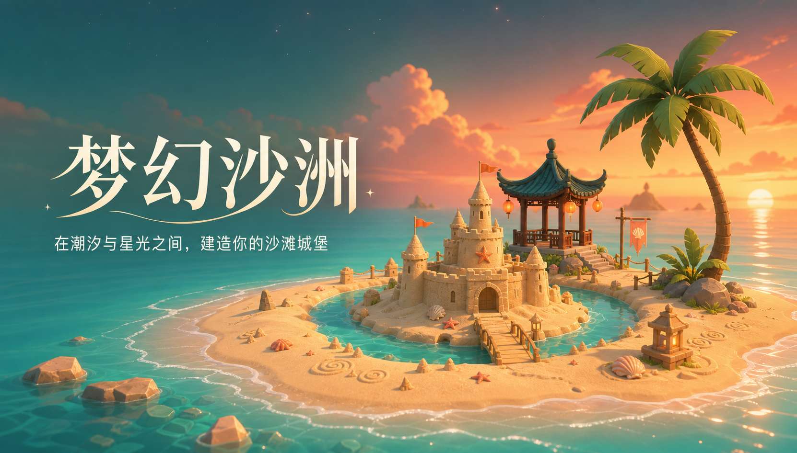
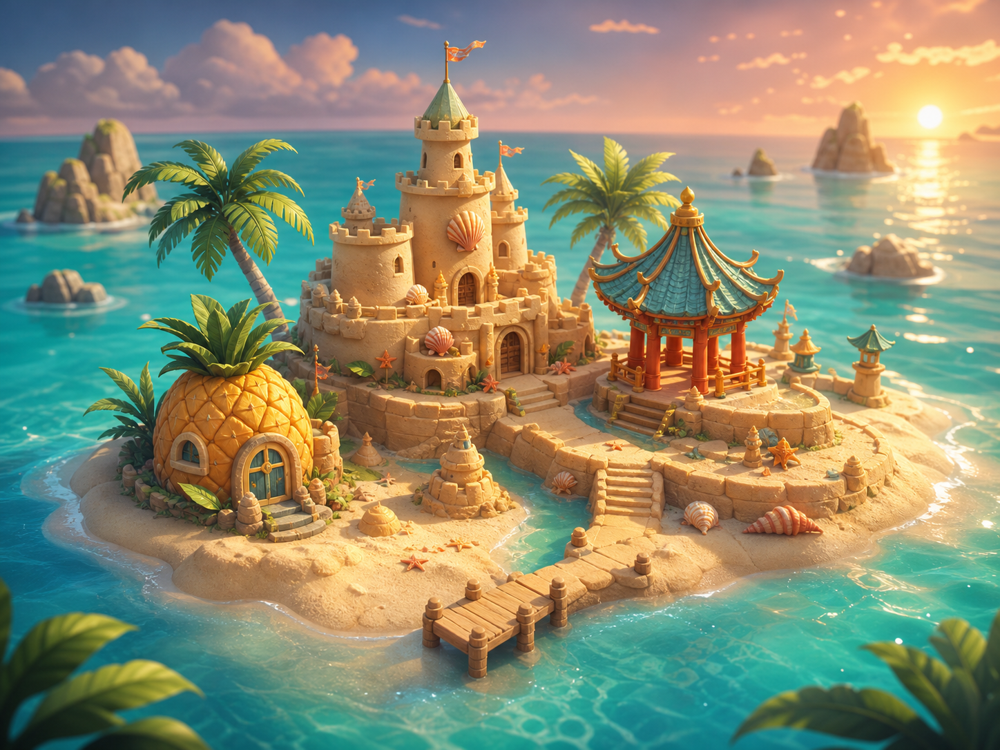

<div align="center">



# Dreamtide Sandbar

**A cozy 3D sandcastle-building game shaped by tides, weather, and starlight.**

在潮汐与星光之间，建造属于你的梦幻沙洲。

<p>
  
  
  
  
</p>

[游戏特色](#-游戏特色) · [快速开始](#-快速开始) · [操作方式](#-操作方式) · [技术实现](#-技术实现)

</div>

## ✨ 为什么是 Dreamtide Sandbar？

Dreamtide Sandbar（梦幻沙洲）是一款直接运行在浏览器中的 3D 建造游戏。你可以在热带海岸上堆起塔楼、城墙与东方楼阁，挖出真正改变地形的护城河，再看潮水、天气和昼夜循环慢慢改变这座岛。

它没有固定答案，也不催促你赢得比赛。这里更像一块会呼吸的数字沙盘：建造、观察、修补，然后在下一次涨潮前继续想象。

> 自由建造 · 动态潮汐 · 昼夜天气 · 海岛生态 · 本地存档

## 🏝️ 游戏一览



## 🌊 游戏特色

- **自由建造** — 放置沙堡塔楼、连续城墙、拱门、东方楼阁、彩绘牌楼、菠萝小屋、植物与海滩装饰。
- **真实改造地形** — 按住拖动挖掘护城河，沙面高度与低洼积水会随操作改变。
- **动态潮汐与侵蚀** — 涨潮、退潮和暂停潮汐；建筑会受潮变色，并在长时间浸水后降低稳定度。
- **昼夜与天气** — 从清晨、正午到黄昏和星夜，晴天、多云与降雨会同步影响天空、雾效和光照。
- **鲜活的海岛生态** — 小鱼、小虾、螃蟹与游客在沙洲周围活动，游客还会在潮水靠近时寻找安全高地。
- **完整编辑能力** — 支持选择、移动、旋转、复制、删除、修复、加固、撤销与重做。
- **本地存档** — 3 个存档位、自动保存，以及 JSON 存档导入和导出。
- **自动建城** — 一键生成带塔楼、城墙、拱门、护城河和装饰的基础城堡。

## 🎮 操作方式

| 操作 | 按键 / 鼠标 |
| --- | --- |
| 旋转视角 | 鼠标左键拖动 |
| 缩放视角 | 鼠标滚轮 |
| 平移视角 | 鼠标右键拖动 |
| 放置 / 选择 | 鼠标左键点击 |
| 选择塔楼 / 城墙 / 护城河 | `1` / `2` / `3` |
| 旋转当前模具 | `R` |
| 撤销 | `⌘/Ctrl + Z` |
| 重做 | `⌘/Ctrl + Shift + Z` 或 `Ctrl + Y` |
| 复制选中建筑 | `⌘/Ctrl + D` |
| 删除选中建筑 | `Delete` 或 `Backspace` |
| 取消选择 | `Esc` |

## 🚀 快速开始

### 环境要求

- Node.js 18+
- 支持 WebGL 的现代桌面浏览器

### 本地运行

```bash
git clone https://github.com/Mingming-up/dreamtide-sandbar.git
cd dreamtide-sandbar
npm ci
npm run dev
```

启动后访问：

- 官网：`http://localhost:5173/`
- 游戏：`http://localhost:5173/game/`

如果需要固定端口，可以运行：

```bash
npm run dev:stable
```

固定地址为 `http://127.0.0.1:5175`。

## 🛠️ 技术实现

| 技术 | 用途 |
| --- | --- |
| Three.js | 3D 场景、程序化模型、材质、光照、粒子与动画 |
| OrbitControls | 相机旋转、缩放、平移与阻尼 |
| WebGL / GLSL | 官网流体鼠标特效与图形渲染 |
| Vanilla JavaScript | 游戏状态、交互、潮汐、天气、存档与 UI |
| HTML / CSS | 双页面结构、响应式布局和玻璃拟态 HUD |
| Vite | 本地开发、多入口构建与生产打包 |

项目没有使用 React、Vue、Unity 或 Unreal。官网和游戏均由原生前端代码与 Three.js 构建。

## 📁 项目结构

```text
dreamtide-sandbar/
├── index.html                 # 官网入口
├── game/index.html            # 游戏入口
├── src/
│   ├── landing.js             # 官网交互
│   ├── landing.css            # 官网样式
│   ├── splashCursor.js        # WebGL 流体鼠标效果
│   ├── main.js                # 3D 游戏与全部核心系统
│   └── styles.css             # 游戏 HUD 与界面样式
├── public/                    # 图片、音频、字体和 3D 模型资源
├── scripts/                   # 构建辅助脚本
├── TECHNICAL_MANUAL.md        # 技术手册
└── FEATURE_LOG.md             # 功能记录
```

## ✅ 检查与构建

```bash
# JavaScript 语法检查
npm run check

# 生产构建
npm run build

# 本地预览生产版本
npm run preview
```

生产文件会生成到 `dist/`。游戏主包包含 Three.js 与完整的程序化模型代码，因此构建时可能出现 chunk 大小提示，但不会影响构建成功。

## 📖 更多文档

- [技术手册](./TECHNICAL_MANUAL.md) — 架构、渲染、游戏系统、构建与扩展方式
- [功能记录](./FEATURE_LOG.md) — 已实现玩法、交互优化与验证记录

## 🌅 项目愿景

让浏览器成为一片可以随时抵达的海岸。没有标准答案，只有不断变化的潮水，以及你亲手留下的城堡。

<div align="center">

Made with sand, tides, and a little starlight by [Mingming-up](https://github.com/Mingming-up).

</div>
