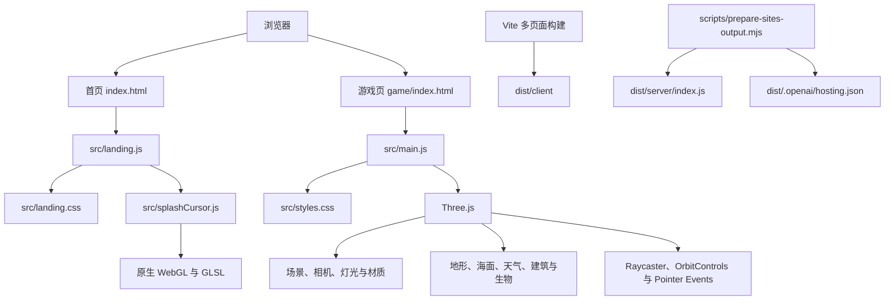

# 梦幻沙洲技术手册

> 项目名称：Tropical Sandcastle / 梦幻沙洲  
> 项目版本：`0.2.0`  
> 文档更新时间：2026-07-16

## 1. 项目概述

梦幻沙洲是一个直接运行在浏览器中的 3D 沙洲建造游戏。项目由展示首页和游戏页面两部分组成：

- `/`：项目展示首页，介绍游戏特色和玩法。
- `/game/`：Three.js 3D 游戏主页面。

项目采用原生 HTML、CSS 和 JavaScript，不依赖 React、Vue 等 UI 框架，也没有使用 Unity、Unreal、Cannon.js 等完整游戏或物理引擎。3D 场景、交互、潮汐、天气、侵蚀、建筑状态和粒子效果均由项目代码直接实现。

## 2. 技术栈总览

| 类别 | 技术 | 当前版本或形式 | 用途 |
| --- | --- | --- | --- |
| 编程语言 | JavaScript | ES Modules | 游戏逻辑、首页交互、WebGL 流体效果 |
| 页面结构 | HTML5 | 原生 HTML | 首页和游戏页入口、SEO 与语义结构 |
| 样式系统 | CSS3 | 原生 CSS | 响应式布局、动画、玻璃面板和游戏 HUD |
| 3D 渲染 | Three.js | `0.167.1` | 场景、相机、灯光、材质、几何体和动画 |
| 相机控制 | OrbitControls | Three.js examples | 旋转、缩放和观察 3D 沙洲 |
| 扩展几何体 | RoundedBoxGeometry | Three.js examples | 创建圆角建筑部件 |
| 几何体工具 | BufferGeometryUtils | Three.js examples | 顶点合并和程序化网格处理 |
| 构建工具 | Vite | `5.4.21` | 本地开发、模块打包、资源处理和生产构建 |
| 首页特效 | WebGL / GLSL | 项目内实现 | 鼠标流体拖尾和颜色扩散效果 |
| 2D 动态纹理 | Canvas 2D API | 浏览器原生 API | 天空、云、月亮、文字标牌和建筑纹理 |
| 托管结构 | OpenAI Sites | `.openai/hosting.json` | 静态资源与 Worker 入口的托管配置 |
| 包管理 | npm | `package-lock.json` | 锁定依赖版本并保证安装一致性 |

### 2.1 项目没有使用的技术

理解这一点有助于避免后续维护时引入错误假设：

- 没有 React、Vue、Svelte 等组件框架。
- 没有 TypeScript。
- 没有后端业务服务、账号系统或数据库。
- 没有独立物理引擎，建筑稳定、漂浮、侵蚀等属于自定义规则模拟。
- 没有加载 GLTF、FBX 等外部 3D 模型；主体模型由 Three.js 几何体和程序化顶点生成。
- 首页流体效果虽然参考了 React Bits Splash Cursor，但当前实现是独立 JavaScript 模块，不需要 React。

## 3. 总体架构



项目属于 Vite 多页面应用，而不是单页面路由应用。首页和游戏页拥有各自的 HTML 入口与 JavaScript 入口，构建时由 Rollup 同时处理。

## 4. 目录与文件职责

```text
project03-3D渲染游戏/
├── .openai/
│   └── hosting.json              # Sites 项目及存储能力配置
├── game/
│   └── index.html                # 游戏页 HTML 入口
├── public/
│   ├── features/                 # 首页功能展示图片
│   ├── fonts/                    # 本地字体和许可证说明
│   └── og.png                    # 社交分享预览图
├── scripts/
│   ├── clean-dist.mjs            # 构建前清理旧 dist
│   └── prepare-sites-output.mjs  # 生成 Sites Worker 和托管配置
├── src/
│   ├── assets/                   # 由 Vite 处理的源码资源
│   ├── landing.js                # 首页交互与页面切换
│   ├── landing.css               # 首页视觉样式
│   ├── main.js                   # 3D 游戏主体和全部核心系统
│   ├── splashCursor.js           # 首页 WebGL 流体鼠标效果
│   └── styles.css                # 游戏 HUD、工具栏和响应式样式
├── index.html                    # 首页 HTML 入口
├── package.json                  # 依赖和 npm 命令
├── package-lock.json             # 精确依赖锁定文件
├── vite.config.js                # Vite 多入口构建配置
└── TECHNICAL_MANUAL.md           # 本技术手册
```

`dist/` 和 `node_modules/` 都属于生成目录，不应直接修改。源码变更应发生在 `src/`、HTML、配置或脚本文件中。

## 5. 核心依赖说明

### 5.1 Three.js

Three.js 是项目最主要的运行时依赖，负责将 JavaScript 中定义的 3D 场景转换为 WebGL 画面。

项目使用的主要 Three.js 能力包括：

- `Scene`：组织整个游戏世界。
- `WebGLRenderer`：执行 WebGL 渲染，启用抗锯齿、阴影、sRGB 和 ACES 色调映射。
- `PerspectiveCamera`：提供透视相机。
- `OrbitControls`：控制相机旋转、缩放和阻尼。
- `Raycaster`：把鼠标位置投射到沙地，用于选择建造位置。
- `Group`：按建筑、装饰、粒子和环境划分场景节点。
- `MeshStandardMaterial`、`MeshPhysicalMaterial`：实现受灯光影响的 PBR 材质。
- `MeshBasicMaterial`、`PointsMaterial`、`SpriteMaterial`：实现标记、粒子和精灵效果。
- `BufferGeometry`、`BufferAttribute`：管理可动态修改的顶点数据。
- `InstancedMesh`：批量渲染珊瑚和石子，降低 draw call。
- `CanvasTexture`：把 Canvas 2D 绘制结果作为 3D 纹理。
- `Clock`：提供逐帧时间差，保证动画速度不依赖显示器刷新率。

### 5.2 Three.js examples 模块

这些模块随 `three` 包一起安装，不是额外 npm 依赖：

- `OrbitControls`：相机控制器。
- `RoundedBoxGeometry`：圆角盒体几何体。
- `mergeVertices`：合并重合顶点，使程序化几何体能够正确计算法线。

### 5.3 Vite

Vite 同时承担开发服务器和生产构建职责：

- 解析 ES Module 导入。
- 将 CSS 和图片作为模块处理。
- 提供开发阶段热更新。
- 使用 Rollup 生成压缩后的生产资源。
- 根据 `vite.config.js` 构建首页和游戏页两个入口。

当前 `vite.config.js` 将生产文件输出到 `dist/client`。

## 6. 首页技术实现

首页由 `index.html`、`src/landing.js` 和 `src/landing.css` 组成。

主要实现包括：

- 原生 DOM 查询和事件绑定。
- 三屏式页面切换和 URL hash 同步。
- 鼠标滚轮、键盘、按钮和锚点导航。
- `IntersectionObserver` 驱动内容进入动画。
- `requestAnimationFrame` 合并鼠标视差更新。
- `aria-*`、键盘操作和 `inert` 属性辅助可访问性。
- `prefers-reduced-motion` 检测；用户要求减少动画时停用高动态效果。
- 使用本地 `Ma Shan Zheng` 字体，并保留系统中文字体回退链。

### 6.1 Splash Cursor 流体效果

`src/splashCursor.js` 是一个独立的原生 WebGL 模块，其实现参考 React Bits Splash Cursor，并在源码头部保留 MIT 来源说明。

它没有使用 Three.js，而是直接使用：

- WebGL 1 / WebGL 2 上下文。
- GLSL 顶点着色器和片元着色器。
- Framebuffer Object（FBO）双缓冲。
- 半浮点纹理。
- 速度场、密度场、压力、旋度和散度计算。
- 鼠标与触摸输入产生的 splat 注入。

模块会在页面隐藏时暂停动画，在销毁时移除监听器并释放 WebGL 上下文，避免后台持续消耗 GPU。

## 7. 游戏渲染系统

### 7.1 渲染器

游戏使用 `THREE.WebGLRenderer`，主要配置如下：

- 抗锯齿：开启。
- 性能偏好：`high-performance`。
- 像素比例：最高限制为 2，避免高 DPI 屏幕产生过大的渲染缓冲。
- 阴影：开启 `PCFSoftShadowMap`。
- 输出色彩空间：sRGB。
- 色调映射：ACES Filmic。

### 7.2 相机与控制

项目使用透视相机和 OrbitControls：

- 相机可以围绕沙洲旋转和缩放。
- 开启阻尼，让移动具有平滑惯性。
- 限制俯仰角和远近距离，避免进入地下或远离场景。

### 7.3 光照与环境

场景包含：

- 太阳方向光。
- 半球环境光。
- 月亮点光源。
- 距离雾。
- 动态天空渐变。
- 昼夜、日出、日落和天气颜色插值。

天空、云、月亮和部分建筑标牌使用 Canvas 动态生成纹理，减少外部图片依赖。

### 7.4 材质体系

项目在 `src/main.js` 中集中维护常用材质，包括沙地、湿沙、建筑、木材、玻璃、金属、植物和水面等。

高频使用的材质和颜色会被复用，避免在动画循环中反复创建对象。建筑工厂函数可以组合共享材质和专用几何体，形成不同模型。

## 8. 游戏系统

### 8.1 游戏状态

核心状态保存在内存中的 `state` 对象，包括：

- 当前选择的模具。
- 建筑旋转角度。
- 潮汐高度与速度。
- 游戏时间与暂停状态。
- 当前天气。
- 全局稳定度、心情值和建造数量。

当前没有存档后端或本地持久化，刷新页面会重新初始化游戏。

### 8.2 程序化地形

沙洲使用细分平面几何体生成：

- 尺寸为 42 × 34。
- 网格细分为 126 × 102。
- 每个顶点拥有基础高度和当前高度。
- 高度由径向形状、噪声式波动和边缘过渡共同生成。
- 挖护城河、压实沙地和潮水侵蚀会直接修改顶点高度。

局部地形操作只扫描影响半径内的网格顶点；连续操作完成后再统一更新法线，以降低 CPU 开销。

### 8.3 建造系统

建造流程如下：

1. 用户从工具面板选择模具。
2. Pointer Event 更新标准化屏幕坐标。
3. Raycaster 检测鼠标与沙地交点。
4. 交点按网格吸附，并检查是否位于可建造区域。
5. 半透明预览模型显示位置、方向和合法性。
6. 点击后调用对应建筑工厂函数生成 Three.js Group。
7. 建筑加入场景根节点和动态更新数组。

建筑模型主要由 Box、Cylinder、Sphere、Cone、Torus、Shape、ExtrudeGeometry 和自定义 BufferGeometry 组合而成。

当前模具包括城堡、门楼、楼阁、建筑、车辆、植物、人物和沙滩装饰等类型。模具列表是界面和放置逻辑的统一入口。

### 8.4 墙体与护城河拖拽

- 墙体支持持续拖动建造、网格吸附和分段连接。
- 护城河通过连续笔刷修改地形，并按距离添加水面片。
- Pointer Move 事件被合并到动画帧中，避免高频事件重复执行射线检测。

### 8.5 潮汐和侵蚀

潮汐高度由基础高度、涨退潮状态和多个正弦波叠加计算。

潮汐会影响：

- 海面高度和水面颜色。
- 沙地湿润程度。
- 建筑受潮、侵蚀与稳定度。
- 浮木和装饰漂浮。
- 游客避水行为。
- 护城河蓄水表现。

侵蚀系统是视觉化的规则模拟，并非真实流体或土壤物理仿真。

### 8.6 天气与昼夜

游戏时间持续推进，并在晴天、阴天和雨天之间变化。系统会同步调整：

- 太阳和月亮位置、颜色与强度。
- 天空渐变和雾颜色。
- 云层数量、透明度和移动。
- 星星、雨滴和月晕可见性。
- 海水材质和建筑照明氛围。

### 8.7 动态对象

每帧需要更新的对象被放入专门数组，而不是遍历整个场景：

- `buildObjects`：需要计算稳定度、受潮和侵蚀的建筑。
- `dynamicDecorations`：浮木、海藻、旗帜和游客等动态装饰。
- `marineLife`：鱼、虾和螃蟹等海洋生物。
- `sandPuffs`：沙尘和湿沙粒子。

这种组织方式可以把逐帧计算限制在确实需要更新的对象上。

### 8.8 撤销系统

项目使用内存快照实现撤销：

- 默认最多保留 12 步。
- 快照记录建筑节点、装饰节点、动态对象数组、地形高度和核心状态。
- 支持界面按钮和 `Ctrl/Cmd + Z`。
- 粒子属于瞬时视觉效果，不进入历史快照。

### 8.9 UI 系统

游戏 HUD 由 JavaScript 创建 DOM 结构，CSS 控制布局和视觉样式。UI 包括：

- 模具选择。
- 旋转、撤销、清空和自动建城。
- 潮汐控制。
- 时间控制。
- 稳定度、心情和潮位仪表。
- 建造提示、状态信息和 Toast。

仪表和文本使用缓存值，仅在内容变化时写入 DOM；整体 UI 更新频率限制为每秒 10 次。

## 9. 主循环

游戏通过 `requestAnimationFrame` 运行主循环：

```text
读取 dt
  → 更新天气与昼夜
  → 计算潮位
  → 更新海面
  → 更新海洋生物
  → 更新建筑稳定和侵蚀
  → 更新装饰与游客
  → 更新粒子
  → 更新地形湿润状态
  → 按需更新 UI
  → 更新相机控制
  → 渲染场景
```

所有与移动速度相关的计算应基于 `dt`，不能默认浏览器固定运行在 60 FPS。

## 10. 性能设计

当前项目已经采用以下性能策略：

- 渲染像素比例限制为 2。
- 静态珊瑚和石子使用 `InstancedMesh`。
- 海面顶点以 30 Hz 更新，海面法线以 15 Hz 更新。
- 天空 Canvas 纹理限制刷新频率。
- UI 限频并避免相同 DOM 内容重复写入。
- Pointer Move 每个动画帧最多处理一次。
- 地形笔刷只访问局部顶点。
- 连续地形修改合并法线计算。
- 粒子共享几何体，并使用对象池复用 Mesh 和材质。
- 帧内颜色对象被缓存，避免产生大量临时 `THREE.Color`。
- 页面隐藏时暂停首页流体动画。
- 使用 `prefers-reduced-motion` 尊重系统减少动态效果设置。

维护时应避免在 `animate()` 及其高频调用函数中反复执行以下操作：

- `new THREE.Color()`、`new THREE.Vector3()` 等临时对象创建。
- 新建 Geometry、Material 或 Texture。
- 无条件修改 DOM。
- 对整个 Scene 执行 `traverse()`。
- 每帧执行高细分几何体的 `computeVertexNormals()`。

## 11. 本地开发与构建

### 11.1 安装依赖

```bash
npm ci
```

`npm ci` 会严格按照 `package-lock.json` 安装依赖，适合首次拉取项目和自动构建环境。

### 11.2 启动开发服务器

```bash
npm run dev
```

需要固定端口时：

```bash
npm run dev:stable
```

固定地址为 `http://127.0.0.1:5175`。游戏页路径为 `/game/`。

### 11.3 语法检查

```bash
npm run check
```

该命令检查首页、游戏、流体模块和构建脚本的 JavaScript 语法。

### 11.4 生产构建

```bash
npm run build
```

构建流程为：

1. `clean-dist.mjs` 删除旧的 `dist`，防止历史文件残留。
2. Vite 构建首页和游戏页到 `dist/client`。
3. `prepare-sites-output.mjs` 生成 `dist/server/index.js`。
4. 复制 Sites 配置到 `dist/.openai/hosting.json`。

### 11.5 本地预览生产版本

```bash
npm run preview
```

## 12. Sites 托管结构

`.openai/hosting.json` 保存 Sites 项目标识。目前：

- D1 数据库：未启用。
- R2 对象存储：未启用。
- 游戏状态完全位于浏览器内存中。

生产 Worker 的职责很小：

- 将 `/game` 永久重定向到 `/game/`。
- 其他请求交给 Sites 静态资源绑定 `env.ASSETS`。

不要手动修改 `dist/server/index.js`；它会在每次构建时重新生成。需要调整路由时，应修改 `scripts/prepare-sites-output.mjs`。

## 13. 如何扩展项目

### 13.1 添加新建造模具

通常需要完成以下步骤：

1. 在 `molds` 数组添加模具描述、图标和提示。
2. 为模具编写 `createXxx(x, z, rotation)` 工厂函数。
3. 使用已有共享材质，或在材质表中添加可复用材质。
4. 在预览模型生成逻辑中添加对应形状。
5. 在 `placeMold()` 中添加放置分支。
6. 根据对象是否会运动，加入建筑、静态装饰或动态装饰集合。
7. 验证旋转、撤销、清空、潮汐和边界放置。

### 13.2 添加新天气

需要同步检查：

- 天气状态切换。
- 天空、雾和灯光颜色。
- 云、雨、星星、月亮的显示逻辑。
- 海水颜色和粗糙度。
- 首页或 HUD 中的天气文案。

### 13.3 修改地形

地形修改必须同时维护：

- `terrain.heights` 当前高度。
- Geometry position attribute 的 Y 值。
- `position.needsUpdate`。
- 修改结束后的顶点法线。

连续修改应使用现有的延迟更新机制，不要在每个顶点或每个笔刷步骤中重新计算完整法线。

### 13.4 添加资源

- 需要原样复制、通过固定 URL 访问的资源放入 `public/`。
- 需要由 JavaScript 导入并生成带哈希文件名的资源放入 `src/assets/`。
- 不要把大型源文件直接放入 `src/main.js`。
- 图片加入前应压缩，并确认使用权限。

## 14. 代码维护约定

- 使用 ES Module `import` / `export`。
- 保持原生 JavaScript 架构，除非项目明确决定迁移框架。
- 优先复用 Geometry、Material、Texture 和临时向量。
- 新增逐帧逻辑前先评估其执行频率和对象数量。
- 所有动画速度使用 `dt`。
- 场景对象应加入职责明确的根组或动态数组。
- UI 状态改变后调用集中更新函数，不要在多个位置直接重复修改相同 DOM。
- 修改功能后至少运行 `npm run check` 和 `npm run build`。
- 不要直接编辑 `dist/`。
- 不要提交 `node_modules/`。

## 15. 浏览器与可访问性

项目依赖 WebGL、ES Modules、Pointer Events 和现代 CSS，因此主要面向现代桌面浏览器。

已有兼容设计包括：

- WebGL 2 不可用时尝试 WebGL 1。
- 不支持线性半浮点纹理过滤时降低流体效果分辨率和着色复杂度。
- 首页内容观察器不可用时直接显示内容。
- 键盘页面导航和游戏快捷键。
- 语义化标签、ARIA 标签和焦点操作。
- 减少动态效果媒体查询。
- 多档响应式布局。

游戏的核心操作以电脑浏览器和鼠标为主要目标。移动端虽包含响应式界面和触摸流体输入，但复杂 3D 建造体验仍应以桌面端作为主要验收环境。

## 16. 当前工程边界

- `src/main.js` 集中了大量游戏系统和模型工厂，便于直接阅读完整流程，但文件规模较大。未来只有在具备可靠回归验证时，才适合按系统逐步拆分模块。
- 当前检查以 JavaScript 语法和生产构建为主，尚未配置单元测试、端到端测试或性能基准自动化。
- 游戏主包包含 Three.js 和完整程序化模型代码，Vite 会产生大于 500 kB 的 chunk 提示；该提示不代表构建失败。
- 当前没有游戏存档、联网功能、用户账户或服务端权威状态。
- 随机环境元素使用 `Math.random()`，每次刷新场景细节可能不同，也不支持固定随机种子复现。

## 17. 资源与许可证注意事项

- `public/fonts/MaShanZheng-OFL.txt` 保存了 Ma Shan Zheng 字体的 OFL 许可证说明。
- `src/splashCursor.js` 保留了所参考流体效果的 MIT 来源说明。
- 项目包含品牌名称、品牌标志和车辆外观等素材；如果用于公开发布、商业用途或素材再分发，应单独确认相应的商标、品牌和图片使用权限。

---

维护本项目时，最重要的原则是：保持现有玩法不变、把高频计算限制在必要范围内、复用 GPU 资源，并在每次修改后完成语法检查和生产构建。
